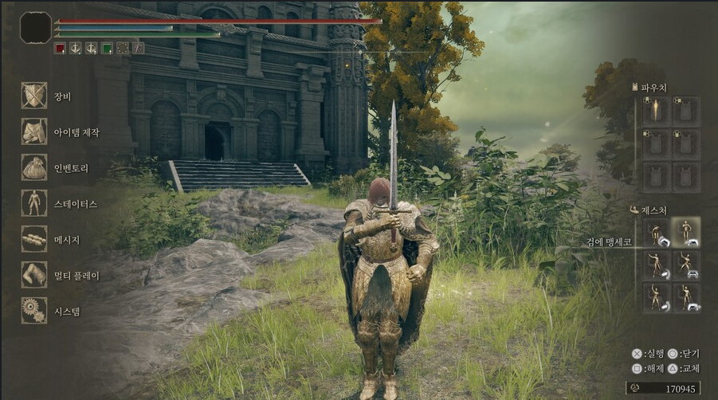
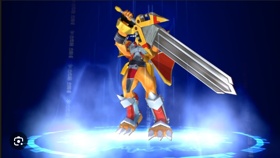

수인 세계관 속 게임 설정 구상

\- 게임 속 세계관 설정을 논의하며, 수인 종족과 관련된 스킬 및 특징을 구상함.

&nbsp;	-> 상층민과 하층민으로 두가지 진영으로 나누기

&nbsp;	-> 둘의 차이를 주기 위해서 하층민은 수인으로 디자인

&nbsp;	-> 플레이어는 인간임 => 수인을 도와주고, 다른 적의 도시에 섞여 들어서 반군 활동을 할 수 있게끔 설정함

&nbsp;	-> 전체 대륙 디자인과 플레이어의 진행 방향도 함께 디자인

&nbsp;	-> 각 마나샘을 해방 시키면 수인들이 인간으로 다시 돌아오는 스토리

&nbsp;	-> 

\- 마나샘 파괴, 스킬 획득, 전투 진행 위치 등 게임 진행 방식에 대한 아이디어를 나눔.

&nbsp;	-> 마나샘은 마나샘을 가지고 있는 도시에서 보스가 지키고 있다.

&nbsp;	-> 도시는 중세 유럽풍 판타지의 도시이고 레퍼런스를 실제 유럽의 전통건축양식 + 반지의 제왕 시리즈의 도시로 잡았다.

&nbsp;	-> 도시에서 전투 및 퀘스트를 진행하며 도시는 기본적으로 적진으로 설정

&nbsp;	-> 도시와 도시 사이의 필드 => ***미정(작은 시골 마을이나, 경비초소?)***	

&nbsp;	-> 각 도시의 보스를 잡으면 마나샘을 해방한다.

\- 플레이어 스킬 획득 조건 및 연출에 대한 아이디어를 제시함.

&nbsp;	-> 플레이어의 스킬 => 미정

&nbsp;	->  획득 조건 = 각 무기의 파츠 강화, 스토리 진행, 레벨 업

맵 디자인 및 보스 몬스터 스킬 구체화

\- 게임 맵 디자인 컨셉을 논의하며, 도시, 평원, 산맥 등 다양한 지형지물을 활용한 맵 구성 방안을 모색함.

&nbsp;	-> 필드에 자연적인 방벽으로 산맥을 이용하고 바다로 한계선을 만들 예정

&nbsp;	

\- 첫 번째 보스 몬스터의 스킬을 구체화하고, 스킬 이름, 효과, 연출 등에 대한 아이디어를 제시함.

&nbsp;	-> 보스 "테이너"의 검, 채찍, 마법 난사의 3페이즈 구성

&nbsp;	-> 검 => "tiguous 검", 검은 대검으로 설정, 묵직한 느낌으로 스킬 사용 => "세로 베기", "가로베기", "연속 베기" 단순한 공격 위주 

&nbsp;	-> 채찍 => linked 채찍으로 철사를 연결한 느낌으로 디자인, 검의 모습에서 일정한 간격으로 칼날이 분리되면서 채찍을 구성하면 좋을듯, 
				채찍으로 중거리 "후리기", 바닥을 쓸면서 빙글빙글도는 "바닥쓸기"
		->  마법 난사 => 채찍의 칼날들이 분리되서 공중에 떠있음, 보스는 칼손잡이를 레이저 포인터처럼 칼날들을 선택

&nbsp;		=> 하나를 직선으로 "던지기",  "반원을 그리면서 던지기", 발악 패턴 "여러개 연속으로 일정 범위 던지기" 

\- 보스 몬스터의 외형 컨셉을 설정하고, 몬스터 디자인 및 스킬 연출에 대한 레퍼런스를 참고함.

&nbsp;	->  완전 스테리오 타입의 기사로 설정, 눈이나 얼굴이 보이지 않는 투구 착용

내부 필드 맵 구조 및 디자인 논의

\- 내부 필드 맵 구조 및 디자인 컨셉을 논의하며, 파르테논 신전 스타일의 맵 디자인을 구상함.

&nbsp;	-> 내부 바닥을 대리석 바닥으로, 파르테논 신전의 기둥을 배치하여 유저가 사용 할 수 있도록 설정

\- 맵의 밝기, 바닥 재질, 기둥 배치 등 세부 디자인 요소에 대한 아이디어를 제시함.

\- 보스 몬스터의 이동 속도 및 공격 패턴, 맵 오브젝트 파괴 효과 등 게임 플레이 요소에 대한 논의를 진행함.

&nbsp;	-> 보스가 유저들을 쫒을 수 있도록 설정하고 멀리 떨어질경우 돌진을 사용하는 것을 고려

&nbsp;	-> 채찍 패턴때 기둥파괴

게임세상에서 obj큐브 1,1,1 -> 1m,1m,1m 우리세계 1=1m

재작 재료:

광물
- 일반등급: 철광석, 구리광석, 조잡한 강철, 경철, 흑요석, 암석강철, 
- 희귀등급: 운철, 청동, 은빛 광석, 수정 파편, 월광석, 서리철, 
- 레어등급: 미스릴, 아다만티움, 우르, 영혼석, 비브라늄, 용혈석, 
- 전설등급: 밤의 눈물 조각, 폭풍우 치는 하늘의 조각, 에테리움, 태초의 별의 먼지, 시초의 금속 (Primordium)

가죽/천
- 일반등급: 낡은 가죽 조각, 질긴 천, 린넨
- 희귀등급: 와이번 가죽, 사냥꾼 늑대의 가죽, 야수의 가죽, 정령의 실타래
- 레어등급: 고대 괴수의 비늘, 심연의 그림자 천, 서리 거미줄
- 전설등급: 용의 비늘, 불사조의 깃털, 별빛을 엮은 실타래, 운명의 실

나무/뼈
- 일반등급: 질긴 참나무, 회색 소나무, 돌 버드나무, 들짐승의 뼈, 동물 뼛조각, 
- 희귀등급: 용혈수, 별빛이 스민 나무, 철심목, 빛 이끼나무, 늑대 이빨, 맹수의 늑골
- 레어등급: 고대 나무의 뿌리, 고대의 야수의 척추, 심연의 마수의 발톱, 빙룡의 파편뼈
- 전설등급: 태고룡의 심장뼈, 천상수호자 뿔, 세계수의 정수

- 보스등급 유일 아이템: 시간의 문지기 고목의 심장, 불사조의 둥지목, 서커스 나무, 노래하는 광대뼈(광대보스)

무기 대검/단검/활 (공격력, 사거리, 공격 쿨타임, 제작 재료)
- 롱소드 엘든링 직검류 느낌(기준점)
	- 
	- 데미지: 10
	- 공격 속도: 10
	- 사거리 : 1
	- 스킬 공격 쿨타임 : 2초 (주스킬기준) => 관통 찌르기(2초)(설명: 상대 명치부근에 강력하게 관통 찌르기를 한다. (개발자수치: 데미지 20))
	- 제작 재료 :   

- 대검 
	- 디자인: 사람크기의 대검
	
	- 컨셉: 

----------------------

### **판타지 월드 몬스터 드랍 재료 기획안 (Ver. EMOJI) ✨**

이 기획의 핵심은 **'환경 🏞️ + 몬스터 👹 = 재료 💎'** 공식을 플레이어가 직관적으로 이해하게 하는 것입니다.

---

#### **Zone 1. 시작의 평원과 온화한 숲 🌳🏞️ (초반 필드)**
* **컨셉:** 갓 시작한 초보 모험가를 위한 구역! 기본적인 제작법을 배우며 게임에 적응합니다.
* **등장 몬스터 및 드랍 아이템:**

| 몬스터 | 드랍 재료 | 등급 | 설명 |
| :--- | :--- | :--- | :--- |
| **👺 고블린** | 질긴 천 🧵, 조잡한 강철 🔩, 동물 뼛조각 🦴 | 일반 | 낡은 옷과 무기를 든 약한 몬스터예요. |
| **🐗 들소/멧돼지** | 낡은 가죽 조각 🟫, 들짐승의 뼈 🦴 | 일반 | 기본적인 가죽과 뼈를 얻을 수 있어요. |
| **🐺 회색 늑대** | 낡은 가죽 조각 🟫, **늑대 이빨** 🦷 | 일반/희귀 | 날카로운 이빨은 꽤 쓸만할지도? |
| **🗿 광맥 골렘** | 철광석 ⛏️, 구리광석 🥉, 암석강철 🪨 | 일반 | 주변의 흔한 광물로 이루어져 있어요. |
| **🌿 필드 채집** | 질긴 참나무 🪵, 회색 소나무 🌲, 돌 버드나무 🌳 | 일반 | 주변에 널린 평범한 나무들이에요. |

---

#### **Zone 2. 서리바람 산맥과 얼어붙은 호수 🏔️❄️ (중급 필드 - 냉기)**
* **컨셉:** 뼛속까지 시린 추위! 냉기 속성 몬스터들이 도사리는 설산 지역입니다.
* **등장 몬스터 및 드랍 아이템:**

| 몬스터 | 드랍 재료 | 등급 | 설명 |
| :--- | :--- | :--- | :--- |
| **🐺‍❄️ 설원 늑대** | **사냥꾼 늑대의 가죽** 🦳, 맹수의 늑골 🦴 | 희귀 | 추위를 이겨낸 튼튼한 가죽과 뼈를 줍니다. |
| **🕷️ 서리 거미** | **서리 거미줄** 🕸️, 수정 파편 💎 | 레어/희귀 | 얼음 실을 뿜어내는 마법 거미예요. |
| **🦍 예티/웬디고** | **야수의 가죽** 💪, 맹수의 늑골 🦴 | 희귀 | 두껍고 질긴 가죽은 최고의 방한용품이죠. |
| **🤖 아이스 골렘** | **서리철** 🧊, 월광석 🌕, **빙룡의 파편뼈** 🐉 | 희귀/레어 | 만년설의 마력이 뭉쳐 태어났어요. |
| **🌲 필드 채집** | 빛 이끼나무 💡, 철심목 🔩 | 희귀 | 혹한 속에서 자란 특별한 나무들이에요. |

---

#### **Zone 3. 불타는 협곡과 용의 둥지 🌋🔥 (중급 필드 - 화염)**
* **컨셉:** 뜨거운 용암이 흐르는 위험 지대! 불과 용의 기운을 품은 몬스터들이 가득합니다.
* **등장 몬스터 및 드랍 아이템:**

| 몬스터 | 드랍 재료 | 등급 | 설명 |
| :--- | :--- | :--- | :--- |
| **🦀 용암 게** | 흑요석 ⚫, 용혈석 🩸 | 일반/레어 | 등껍질이 용암처럼 단단하게 굳었어요. |
| **🦎 화산 도마뱀** | **와이번 가죽** 🐲, 맹수의 늑골 🦴 | 희귀 | 작은 용처럼 생긴 녀석들의 가죽은 질겨요. |
| **🐕 헬하운드** | 야수의 가죽 💪, 늑대 이빨 🦷 | 희귀 | 지옥 불의 기운을 머금은 사나운 개예요. |
| **🐉 어린 와이번** | 와이번 가죽 🐲, **용혈수** 🩸 | 희귀 | 와이번의 피를 먹고 자란 나무를 찾을 수 있어요. |
| **👹 보스: 마그마 골렘** | **운철** ☄️, **용혈석** 🩸 | 희귀/레어 | 화산 깊은 곳의 희귀 광물 결정체예요. |

---

#### **Zone 4. 고대 유적지와 별빛 사막 🏛️✨ (고급 필드 - 마법/고대)**
* **컨셉:** 사라진 문명의 비밀과 별의 힘이 잠들어 있는 신비로운 곳입니다.
* **등장 몬스터 및 드랍 아이템:**

| 몬스터 | 드랍 재료 | 등급 | 설명 |
| :--- | :--- | :--- | :--- |
| **🤖 고대 수호병기** | **미스릴** ✨, **아다만티움** 🛡️, **비브라늄** 🔊 | 레어 | 고대 기술의 결정체! 최상급 금속으로 만들어졌어요. |
| **👻 사막의 모래 망령** | **정령의 실타래** 🧵, **영혼석** 🔮 | 희귀/레어 | 사막에서 스러져간 영혼들이 깃들어 있어요. |
| **🐛 고대의 모래벌레** | **고대 괴수의 비늘** 鱗, **고대의 야수의 척추** 🦴 | 레어 | 사막의 주인! 거대한 고대 생물이에요. |
| **🌵 필드 채집** | **고대 나무의 뿌리** 🕸️, **별빛이 스민 나무** 🌟 | 레어/희귀 | 신비한 힘을 머금고 자란 식물들이에요. |
| **☄️ 히든 보스: 별 포식자**| **태초의 별의 먼지** 🌠, **별빛을 엮은 실타래** ✨ | 전설 | 하늘의 별을 삼키는 공허한 존재예요. |

---

#### **Zone 5. 심연의 균열과 밤의 신전 🌌🔮 (최상위 필드 - 심연/신성)**
* **컨셉:** 다른 차원과 연결된 혼돈의 땅. 가장 위험하고 강력한 존재들이 도사리고 있습니다.
* **등장 몬스터 및 드랍 아이템:**

| 몬스터 | 드랍 재료 | 등급 | 설명 |
| :--- | :--- | :--- | :--- |
| **👤 그림자 암살자** | **심연의 그림자 천** ⬛, **심연의 마수의 발톱** 💅 | 레어 | 그림자 속에서 나타나 날카로운 발톱으로 공격해요. |
| **😈 타락한 천사** | **에테리움** 💫, **밤의 눈물 조각** 💧 | 전설 | 신성함을 잃고 불안정한 마력을 내뿜어요. |
| **👁️ 심연의 감시자** | **시초의 금속** ⚛️, 영혼석 🔮 | 전설/레어 | 세상의 근원을 지키는 혼돈의 파수꾼이에요. |
| **👑 보스: 폭풍의 군주** | **폭풍우 치는 하늘의 조각** ⛈️, **천상수호자 뿔** 뿔 | 전설 | 하늘과 폭풍을 관장하는 신적인 존재예요. |

---

#### **⚔️ 특수 던전 / 월드 보스 👑 (유니크 등급)**
* **컨셉:** 오직 용감한 자들만이 도전할 수 있는 곳! 세상에 단 하나뿐인 재료를 얻을 수 있습니다.
| 보스 몬스터 | 드랍 재료 | 등급 | 설명 |
| :--- | :--- | :--- | :--- |
| **🌳 시간의 문지기, 이그드라실**| **시간의 문지기 고목의 심장** 💖, **세계수의 정수** 🌿| 유일/전설 | 시간의 흐름을 지키는 태고의 나무 정령이에요. |
| **🐦🔥 재의 여왕, 피닉스**| **불사조의 둥지목** 🪺, **불사조의 깃털** 🪶, **용의 비늘** 🐉| 유일/전설 | 불사조는 용과 함께 살며, 그 둥지는 성역이에요. |
| **🤡 노래하는 광대, 서커스단장**| **노래하는 광대뼈** 💀, **운명의 실** 🎗️| 유일/전설 | 사람들의 운명을 비웃으며 조종하는 사악한 광대예요. |
| **🐲 태고룡, 크로노스**| **태고룡의 심장뼈** ❤️, **시초의 금속** ⚛️| 전설 | 세상의 시작부터 존재했던 최초의 용이에요. |
